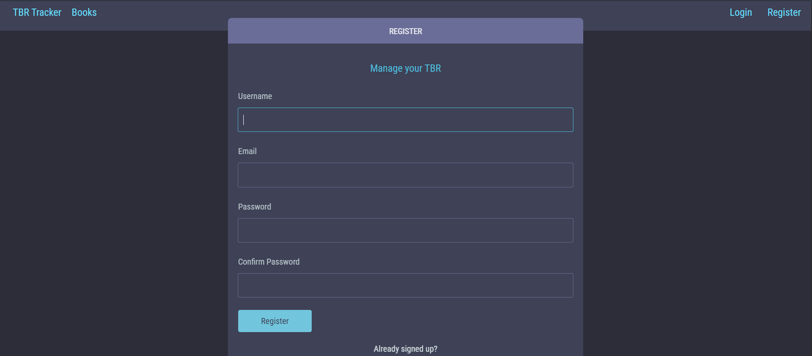
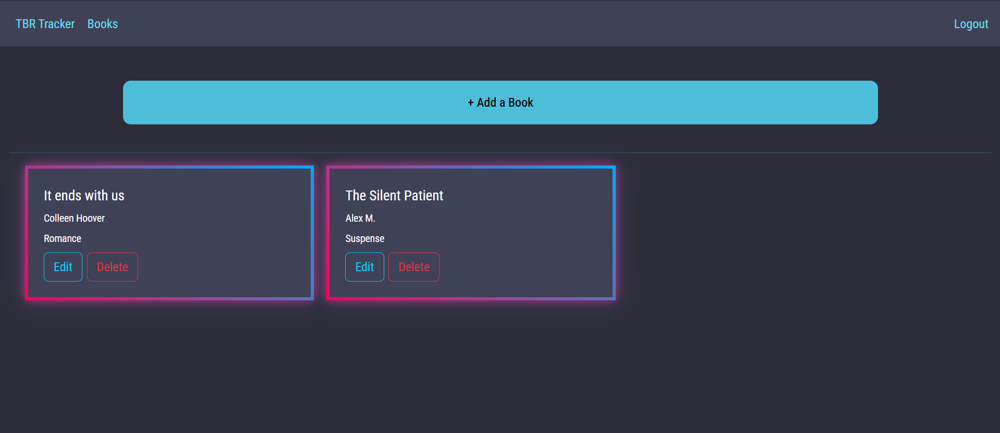

# To-Be-Read Tracker

[](https://deepwiki.com/Usaim-Khan/To-Be-Read-Tracker)

A Django web app for tracking books you want to read. Create an account, add books with title/author/genre, and manage your list from a simple card-based interface.

<!-- Screenshot: login/register page -->


<!-- Screenshot: books list page -->


## Features

- **User accounts** — register, log in, log out; each user only sees their own books
- **Add, edit, delete books** — track title, author, and genre
- **Card-based book list** — clean view of your full reading list


## Tech Stack

| | |
|---|---|
| Backend | Python, Django |
| Frontend | HTML, CSS, Bootstrap |
| Database | SQLite3 |
| Config | `python-dotenv` |

## Getting Started

Runs locally — no live deployment yet.

### Prerequisites

- Python 3.x
- pip

### Installation

```sh
git clone https://github.com/Usaim-Khan/To-Be-Read-Tracker.git
cd To-Be-Read-Tracker
```

```sh
# Windows
python -m venv venv
venv\Scripts\activate

# macOS/Linux
python3 -m venv venv
source venv/bin/activate
```

```sh
pip install -r requirements.txt
```

Set up your environment file:

```sh
cp .env.example .env
```

Open `.env` and replace `your-secret-key-here` with a unique secret string (use a Django secret key generator if you need one).

Apply migrations and run the server:

```sh
python manage.py migrate
python manage.py runserver
```

The app will be available at `http://127.0.0.1:8000/`.

## Usage

1. Go to the homepage and register a new account.
2. Log in — you'll land on your personal Books page.
3. Click **+ Add a Book** and enter a title, author, and genre.
4. Your books appear as cards. Use **Edit** to update details or **Delete** to remove a book once you've read it (or changed your mind).

## Project Structure

```
├── Books/         # Book CRUD app
├── ManageUsers/    # Auth (register/login/logout)
├── ToBeRead/       # Django project settings
└── static/         # CSS/static assets
```
